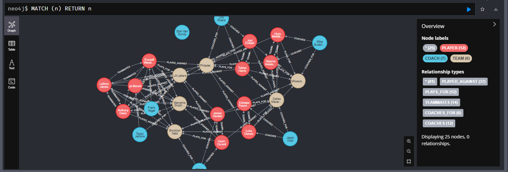
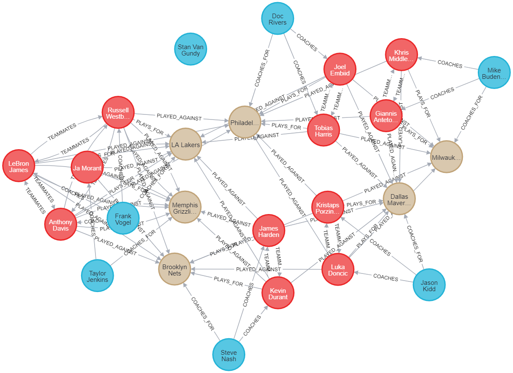
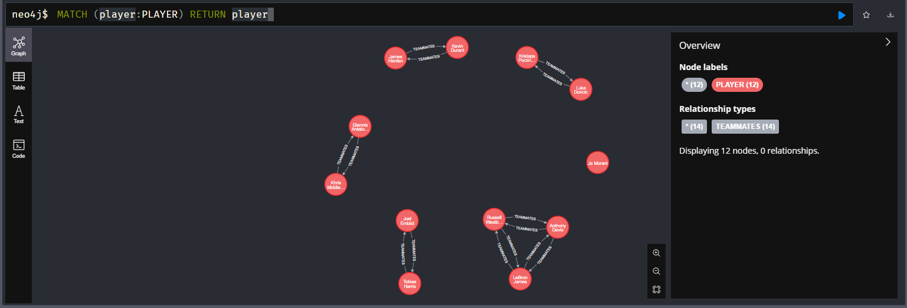
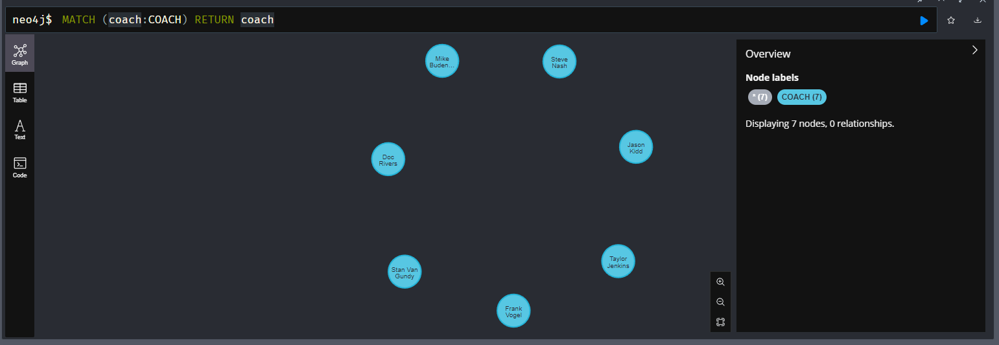
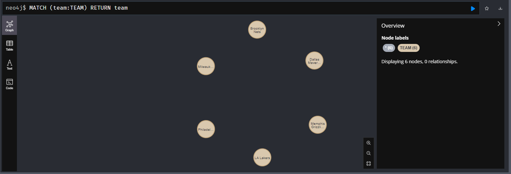
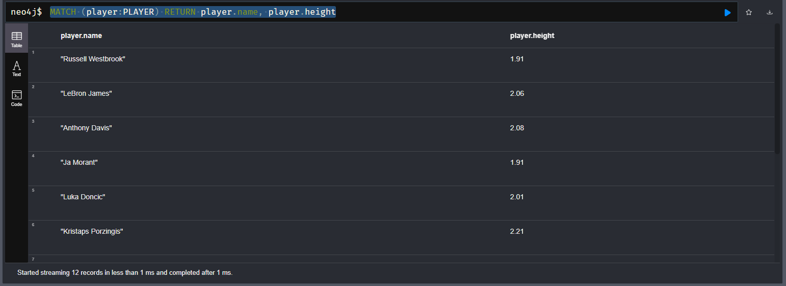
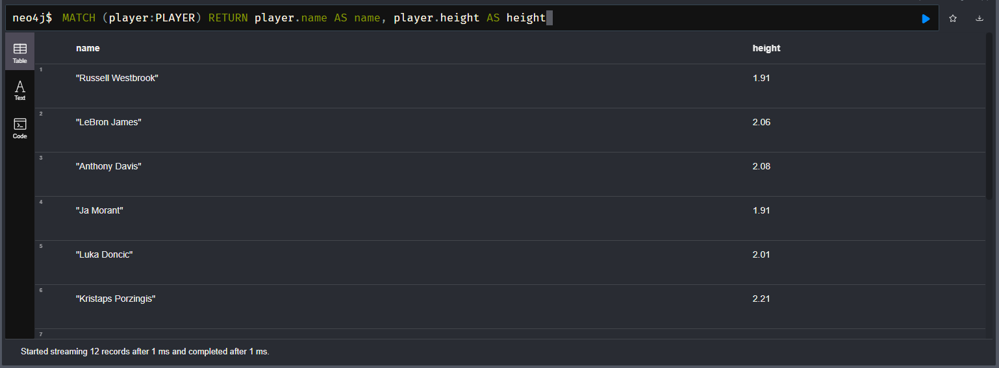

# Querying for Nodes

Inside of Neo4j

2 types
* Nodes - entity, thing - ex: NBA player, coach team
* Relationship

Query Nodes themselves

Keyword `MATCH`
* Query for exact things

Node is represented as two parenthesis "()"

`(n)` can be used but n can be defined as anything - user alias

The `RETURN n`

So:

```
MATCH (n)
RETURN n
```

This will return all of our nodes



You can download that image too



### Filters

What if we just want players?

Remember all nodes have labels attached to them (almost like a table name)
* Can change n to player to be more indicative of the entity type

```cypher
MATCH (player:PLAYER) RETURN player
```



Same with COACH objects

```cypher
MATCH (coach:COACH) RETURN coach
```



Same with Teams

```cypher
MATCH (team:TEAM) RETURN team
```



### Properties

Remember Nodes have different properties

-> We can Fetch specific properies

```cypher
MATCH (player:Player) RETURN player.name
```


This is a table now that we are dealing with lists

Can do multiple columns

```cypher
MATCH (player:PLAYER) RETURN player.name, player.height
```



### Aliasing

You can use keyword `AS` to filter different

```cypher
MATCH (player:PLAYER) RETURN player.name AS name, player.height AS height
```


