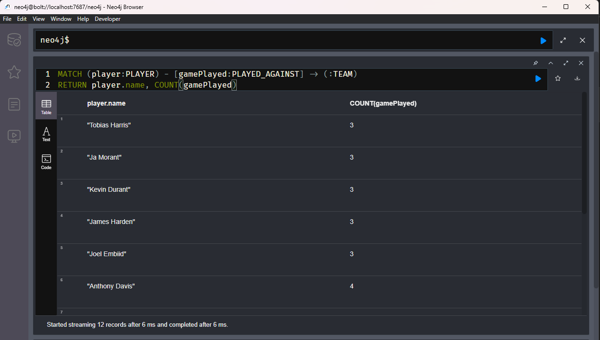
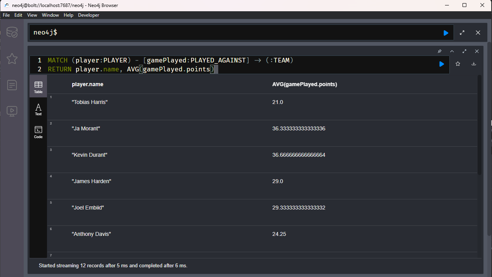
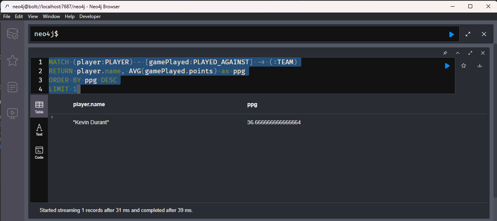

# Aggregating Data

Process where we have multiple data sets and aggregate them into one value.

Best way to learn is via example
* Return a player and the number of games they played
* Get a player and return the number of games they played

```sql
MATCH (player:PLAYER) - [gamePlayed:PLAYED_AGAINST] -> (:TEAM)
RETURN player.name, COUNT(gamePlayed)
```

Now we can do some 



Now change to average points. Games played has this value.



Next we want to figure out who has the most avg points per game

```sql
MATCH (player:PLAYER) - [gamePlayed:PLAYED_AGAINST] -> (:TEAM)
RETURN player.name, AVG(gamePlayed.points) as ppg
ORDER BY ppg DESC
LIMIT 1
```


