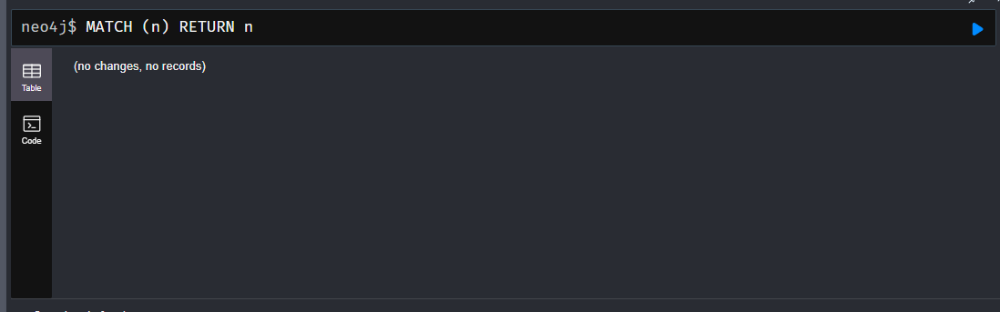
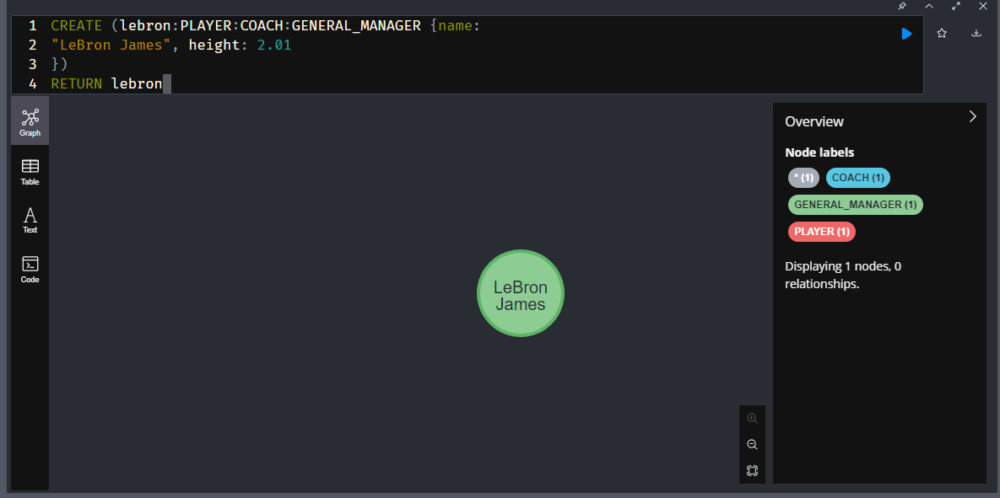
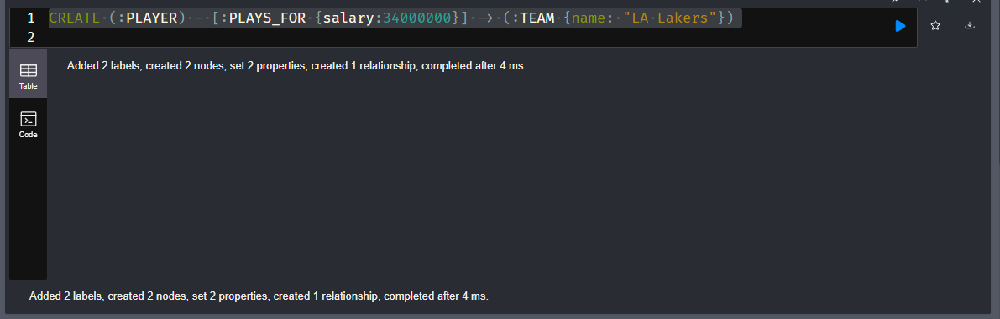
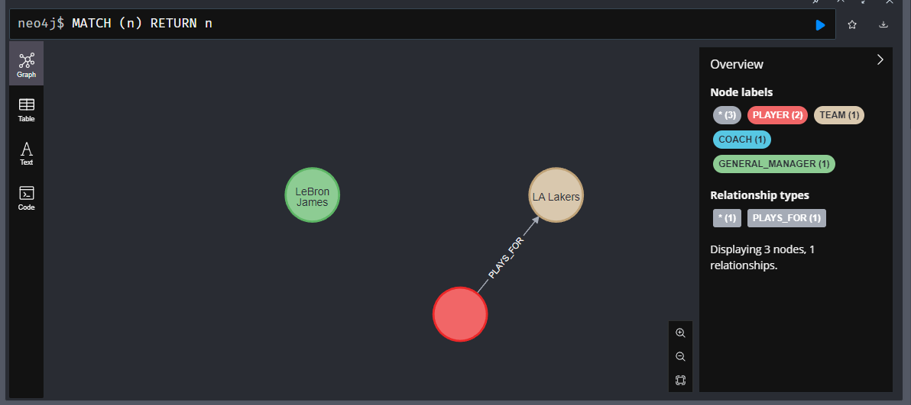
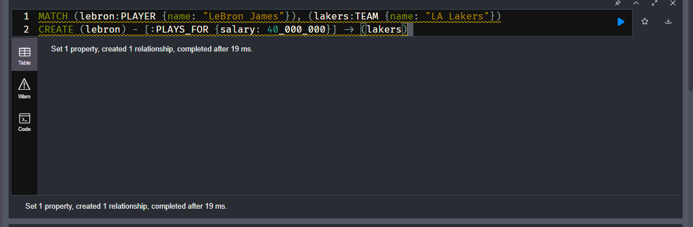
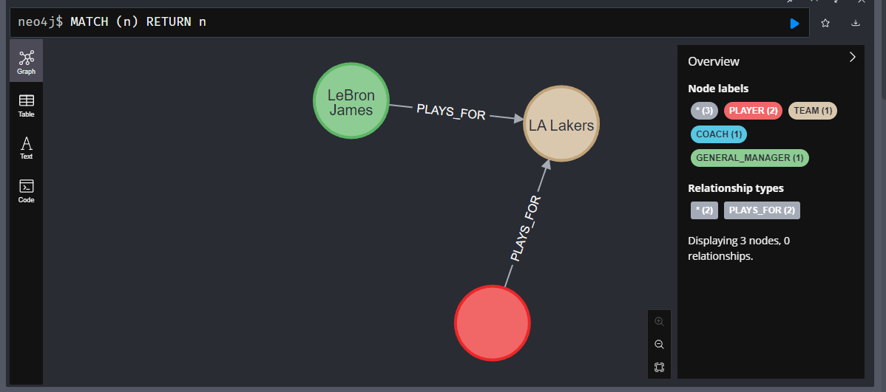

# Creating Nodes and Relationships

Database should be blank from last section



Create a node that is Lebron James

```sql
CREATE (lebron:PLAYER:COACH:GENERAL_MANAGER {name:
"LeBron James", height: 2.01
})
RETURN lebron
```



### Create with relationships

Make Anthony Davis

```sql
CREATE (:PLAYER) - [:PLAYS_FOR {salary:34000000}] -> (:TEAM {name: "LA Lakers"})
```



Now lets look at the data



The red dot here is blank b/c it was not given the name of "Anthony Davis"

### Create relationship off of existing Nodes

Say Lebron now plays for Lakers

```sql
MATCH (lebron:PLAYER {name: "LeBron James"}), (lakers:TEAM {name: "LA Lakers"})
CREATE (lebron) - [:PLAYS_FOR {salary: 40_000_000}] -> (lakers)
```



Now we have the relationship


