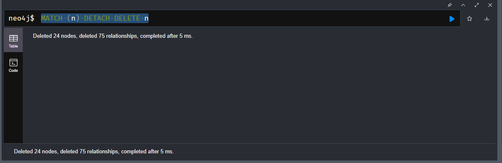

# Deleting Nodes and Relationships

Delete Ja Morant

Find Ja Morant Node and delete

```sql
MATCH (ja {name: "Ja Morant"}) DELETE ja
```


Errors because we still have relationships

Use the `DETACH` keyword to also get rid of all associated relationships

```sql
MATCH (ja {name: "Ja Morant"}) DETACH DELETE ja
```


Now Ja does not exist anywhere


### Deleting just the relationships

Keep Joel Embiid, but delete the plays for relationship

```sql
MATCH (joel {name: "Joel Embiid"}) - [rel:PLAYS_FOR] -> (:TEAM)
DELETE rel
```


No node deleted, but we deleted just the relationship

Now delete every node in the application, on your own

My answer

```sql
MATCH (n) DETACH DELETE n
```



Instructor answer

```sql
MATCH (n)
DETACH DELETE n
```

Reason for this is we are going to next learn how to add data
