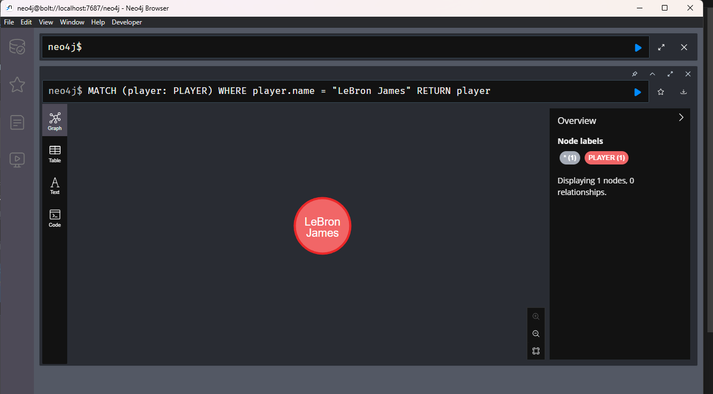

# Filtering for Nodes

We started filtering nodes by utilizing the label

Filter for Nodes within the player label

Begin with a simple thing

Query for Lebron James

This will **NOT** work 

```sql
MATCH (LeBron: PLAYER)
RETURN LeBron
```

We have to use the `WHERE` clause like so

```sql
MATCH (player: PLAYER) 
WHERE player.name = "LeBron James"
RETURN player
```

Which gives



There is another way to filter with key/value pairs

```sql
MATCH (player: PLAYER {name: "LeBron James"}) 
RETURN player
```

Which gives the same results as above

You can comma separate these for additional filtering

```sql
MATCH (player: PLAYER {name: "LeBron James", height:1.2}) 
RETURN player
```


Of course this gives nothing because LJ is 2.06 height in this DB.

But chaning it to 2.06 will gives us LeBron back

```sql
MATCH (player: PLAYER {name: "LeBron James", height:2.06}) 
RETURN player
```


### NOT Operator

Similar to other DBs. This gives us all players that are not LeBron.

```sql
MATCH (player: PLAYER)
WHERE player.name <> "LeBron James" 
RETURN player
```


### Filter by greater than

Similar again to other DBs

```sql
MATCH (player: PLAYER)
WHERE player.height >= 2 
RETURN player
```


Which only excludes Ja Morant, Russ, and James Harden

### Less than

```sql
MATCH (player: PLAYER)
WHERE player.height < 2 
RETURN player
```


### Arithmetic (BMI)

With BMI, weight over height squared

```sql
MATCH (player: PLAYER)
WHERE player.weight / (player.height * player.height) > 25
RETURN player
```


### Multi-filtering with AND

Find players with weight >= 100 kg and height above 2

```sql
MATCH (player: PLAYER)
WHERE player.weight >= 100 and player.height < 2
RETURN player
```


### OR

Lets get the freaks-of-nature with above or at 120kg or above 2.1m

```sql
MATCH (player: PLAYER)
WHERE player.weight >= 120 or player.height > 2.1
RETURN player
```


### NOT

We can reverse the above

```sql
MATCH (player: PLAYER)
WHERE NOT player.weight >= 120 or player.height > 2.15
RETURN player
```

Simply add a not at the front add it reverses the first condition


### LIMIT

To help not overwhelm when using very large datasets

```sql
MATCH (player: PLAYER)
WHERE player.height >= 2
RETURN player
```


```sql
MATCH (player: PLAYER)
WHERE player.height >= 2
RETURN player
LIMIT 5
```


Which just gives us the first 5 items

### SKIP

Used to get the next set of items, SKIP n where n is the number of elements left out of the returned set. Then use `LIMIT` to limit the amount after the skip.

```sql
MATCH (player: PLAYER)
WHERE player.height >= 2
RETURN player
SKIP 2
LIMIT 2
```


We want the first two after the first two basically

### ORDER BY

Similar to other DBs we order the DBs by certain criteria


The Node view won't show much because its a picture but remember we return a list of data in the table view


```json
{
  "identity": 5,
  "labels": [
    "PLAYER"
  ],
  "properties": {
    "number": 6,
    "name": "Kristaps Porzingis",
    "weight": 109,
    "age": 26,
    "height": 2.21
  },
  "elementId": "4:b50cdb57-9c85-49d1-b444-969049e1d5a9:5"
}
{
  "identity": 10,
  "labels": [
    "PLAYER"
  ],
  "properties": {
    "number": 21,
    "name": "Joel Embiid",
    "weight": 127,
    "age": 27,
    "height": 2.13
  },
  "elementId": "4:b50cdb57-9c85-49d1-b444-969049e1d5a9:10"
}
{
  "identity": 8,
  "labels": [
    "PLAYER"
  ],
  "properties": {
    "number": 34,
    "name": "Giannis Antetokounmpo",
    "weight": 110,
    "age": 26,
    "height": 2.11
  },
  "elementId": "4:b50cdb57-9c85-49d1-b444-969049e1d5a9:8"
}
{
  "identity": 2,
  "labels": [
    "PLAYER"
  ],
  "properties": {
    "number": 23,
    "name": "Anthony Davis",
    "weight": 115,
    "age": 28,
    "height": 2.08
  },
  "elementId": "4:b50cdb57-9c85-49d1-b444-969049e1d5a9:2"
}
{
  "identity": 6,
  "labels": [
    "PLAYER"
  ],
  "properties": {
    "number": 7,
    "name": "Kevin Durant",
    "weight": 109,
    "age": 33,
    "height": 2.08
  },
  "elementId": "4:b50cdb57-9c85-49d1-b444-969049e1d5a9:6"
}
{
  "identity": 1,
  "labels": [
    "PLAYER"
  ],
  "properties": {
    "number": 6,
    "name": "LeBron James",
    "weight": 113,
    "age": 36,
    "height": 2.06
  },
  "elementId": "4:b50cdb57-9c85-49d1-b444-969049e1d5a9:1"
}
{
  "identity": 11,
  "labels": [
    "PLAYER"
  ],
  "properties": {
    "number": 22,
    "name": "Tobias Harris",
    "weight": 100,
    "age": 29,
    "height": 2.03
  },
  "elementId": "4:b50cdb57-9c85-49d1-b444-969049e1d5a9:11"
}
{
  "identity": 4,
  "labels": [
    "PLAYER"
  ],
  "properties": {
    "number": 77,
    "name": "Luka Doncic",
    "weight": 104,
    "age": 22,
    "height": 2.01
  },
  "elementId": "4:b50cdb57-9c85-49d1-b444-969049e1d5a9:4"
}
{
  "identity": 9,
  "labels": [
    "PLAYER"
  ],
  "properties": {
    "number": 22,
    "name": "Khris Middleton",
    "weight": 100,
    "age": 30,
    "height": 2.01
  },
  "elementId": "4:b50cdb57-9c85-49d1-b444-969049e1d5a9:9"
}
```

And so we are now ordered by height descending

reverse this to ascending order with `ASC` like other DB models.

### Multiple tables

```sql
MATCH (player: PLAYER), (coach:COACH) 
RETURN player, coach
```


And we can `WHERE` on that

```sql
MATCH (player: PLAYER), (coach:COACH) 
WHERE player.height >= 2
RETURN player, coach
```


Now players are hidden if they are shorter than 2m

Can extend this with commas again to `TEAM`

```sql
MATCH (player: PLAYER), (coach:COACH), (team: TEAM)
WHERE player.height >= 2
RETURN player, coach, team
```


Which looks similar to the beginning when we had everything dumped onto the screen
