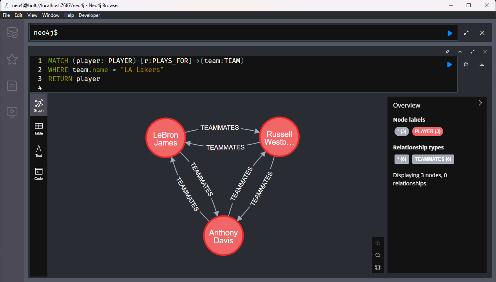
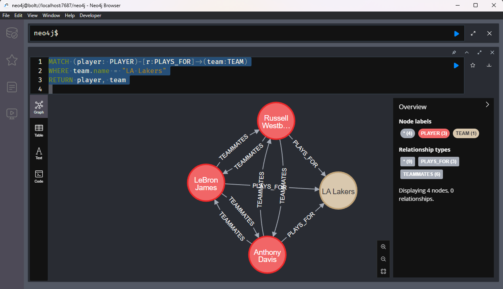
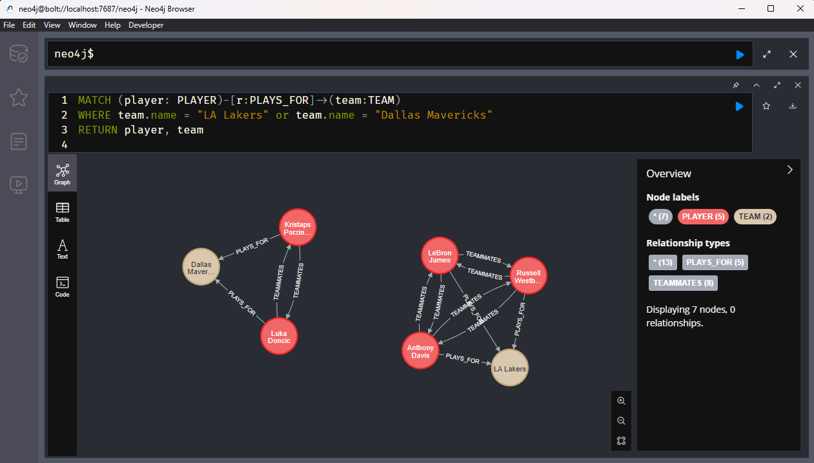
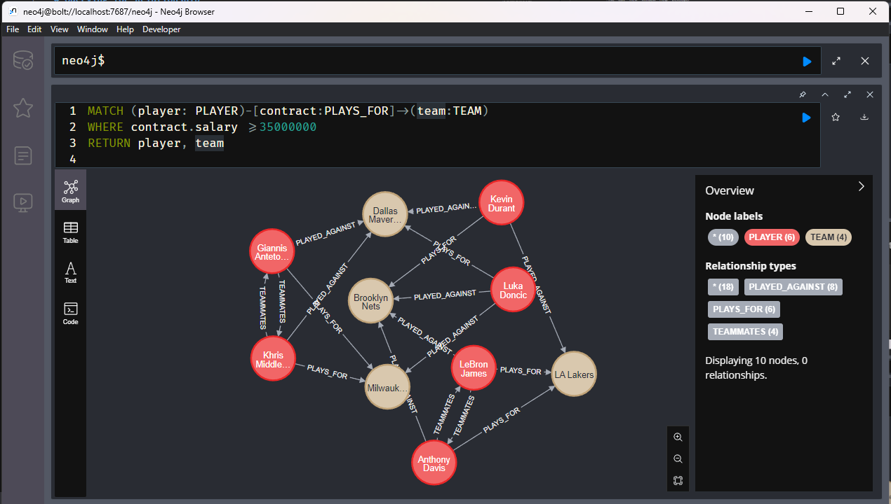

# Querying for Relationship

Remember all the nodes have these relationships

### Query for specific nodes based on relationships

* Ex - All players that play for LA Lakers
* There are no tables linking LeBron to the Lakers
* We want to specifiy the relationship between the two nodes
* Remember - we are moving in one direction

```sql
MATCH (player: PLAYER)-[r:PLAYS_FOR]->(team:TEAM)
WHERE team.name = "LA Lakers"
RETURN player
```



Can also return the team and all other relationships are shown in the graph view

```sql
MATCH (player: PLAYER)-[r:PLAYS_FOR]->(team:TEAM)
WHERE team.name = "LA Lakers"
RETURN player, team
```



And we can use ORs and such to see multiple teams



### Relationship properties

The PLAYS_FOR rel has a "salary" property

This finds the players with at least 35 mil contracts

```sql
MATCH (player: PLAYER)-[contract:PLAYS_FOR]->(team:TEAM)
WHERE contract.salary >= 35000000
RETURN player, team
```



On your own, Lebron teammates that make more that 40


My Answer
```sql
MATCH (lebron:PLAYER)<-[tm:TEAMMATES]-(player: PLAYER)-[contract:PLAYS_FOR]->(team:TEAM)
WHERE contract.salary >= 40000000 AND lebron.name = "LeBron James"
RETURN player
```

We can have another `MATCH` keyword

```sql
MATCH (lebron:PLAYER {name: "LeBron James"})-[:TEAMMATES]->(teammate: PLAYER)
MATCH (teammate)-[contract:PLAYS_FOR]->(team:TEAM)
WHERE contract.salary >= 40000000
RETURN teammate
```
