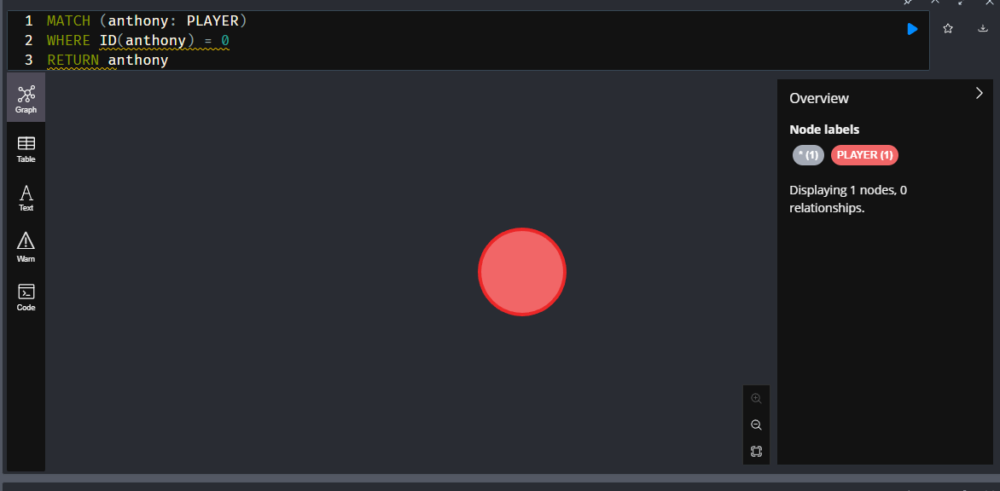
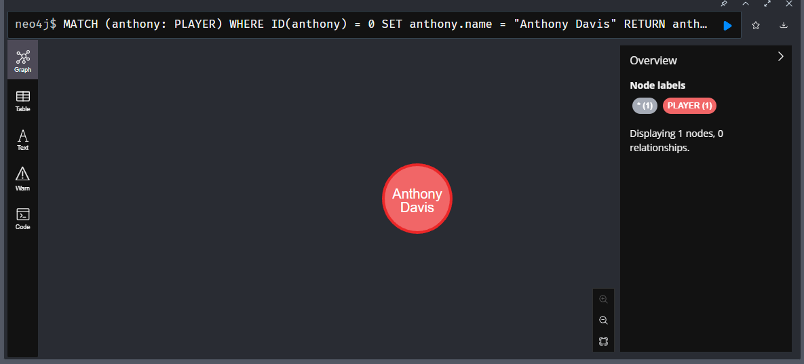
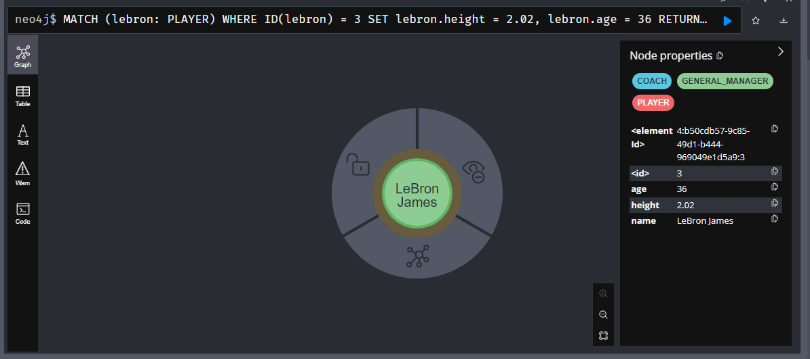
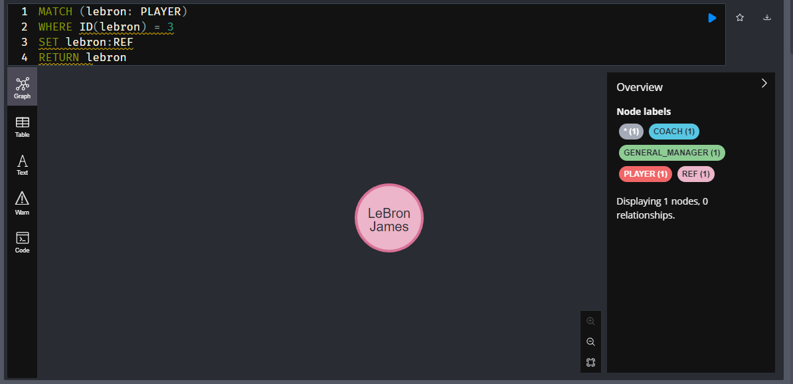
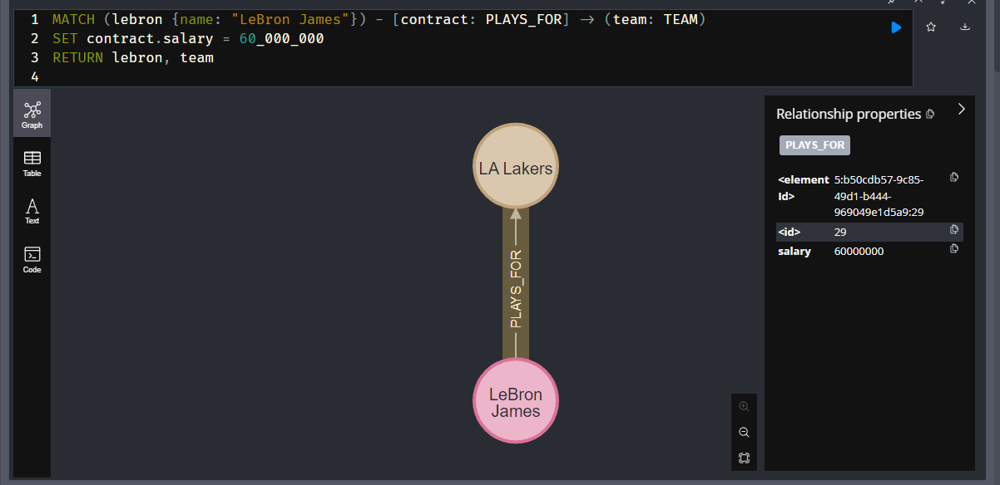
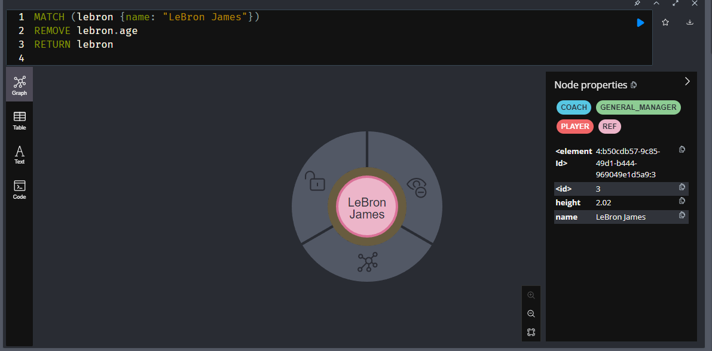
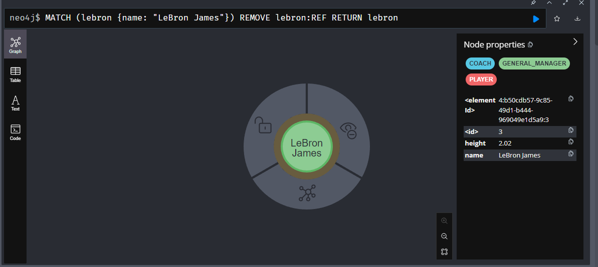

# Updating Nodes and Relationships

We want to add the name of Anthony Davis because we forgot it.
* Query using an id

```sql
MATCH (anthony: PLAYER) 
WHERE ID(anthony) = 0
RETURN anthony
```



### Use `SET`

```sql
MATCH (anthony: PLAYER) 
WHERE ID(anthony) = 0
SET anthony.name = "Anthony Davis"
RETURN anthony
```



## Change and Add props

```sql
MATCH (lebron: PLAYER) 
WHERE ID(lebron) = 3
SET lebron.height = 2.02, lebron.age = 36
RETURN lebron
```



### Adding labels

```
MATCH (lebron: PLAYER) 
WHERE ID(lebron) = 3
SET lebron:REF
RETURN lebron
```

He now has 4 different labels



### Updating relationships

Update the salary to be a little larger

```sql
MATCH (lebron {name: "LeBron James"}) - [contract: PLAYS_FOR] -> (team: TEAM)
SET contract.salary = 60_000_000
RETURN lebron, team
```



### Removing props

Remove the REF label and the age prop from LeBron

```sql
MATCH (lebron: {name: "LeBron James"})
REMOVE lebron.age
```



Same with labels

```sql
MATCH (lebron {name: "LeBron James"})
REMOVE lebron:REF
RETURN lebron
```


